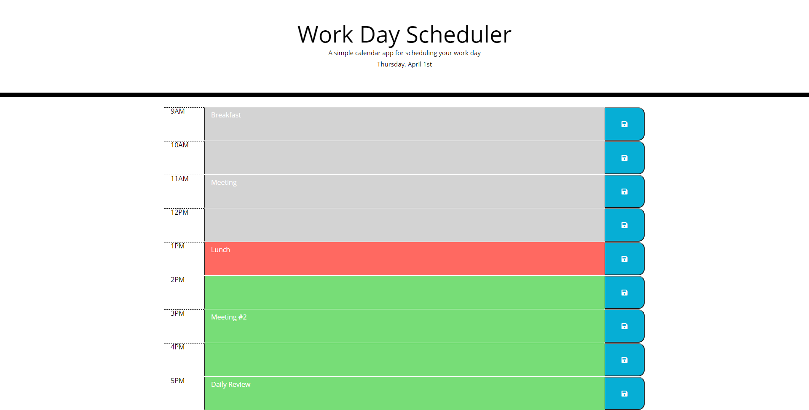

# Work Day Scheduler

## Description

As a developer, I was tasked with building a Work Day Scheduler to store and display important messages.

When the planner is opened, the current day is displayed at the top of the page;

There is a timeblock for each working hour (9-17);

Each timeblock is color coded to indicate whether it is in the past, present or future;

Event can be entered by clicking into the timeblock;

To save an event, simply click the save bottom at the end of each timeblock;

After saving, events persist. You can close the app and open it anytime to see events planned for the day.

## Screenshot of working application

## Link to deployed application

You can access the deployed application [here](https://ttudorandrei.github.io/work_day_scheduler/)

## Link to Github repository

You can access the Github repository [here](https://github.com/ttudorandrei/work_day_scheduler)
